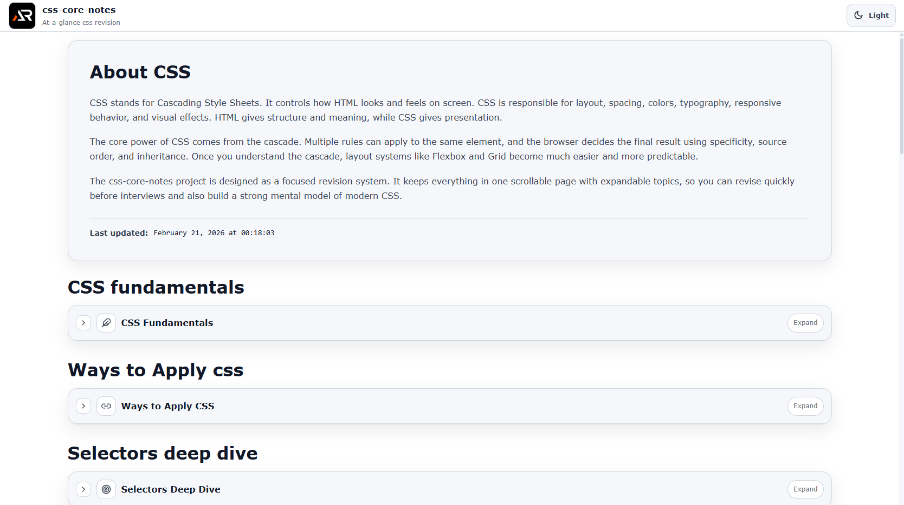

# CSS Core Notes

A single-page, at-a-glance revision project for core CSS concepts.

This project is designed as a fast reference and structured summary sheet covering essential CSS topics without unnecessary depth.  
It focuses on clarity, layout logic, visual behavior, and practical usage in real-world interfaces.

---



---

## Purpose

- Quick revision before interviews
- Rapid recall of layout and styling concepts
- Clear mental model of the CSS cascade and rendering
- Practical, production-focused reminders
- Modern CSS understanding without overload

## Coverage

- CSS fundamentals and cascade
- Selectors and specificity
- Box model and layout mechanics
- Positioning and stacking context
- Flexbox and Grid
- Typography and colors
- Units and responsive design
- Transforms, transitions, animations
- Modern CSS features
- CSS variables and theming
- Accessibility styling basics
- Performance considerations
- Common mistakes and best practices

## Tech Stack

- React
- Vite
- styled-components

## Project Type

Single page only  
Section-based navigation  
Searchable and expandable content  
No blog-style content, only structured notes

Each topic is modular and collapsible for fast scanning.

## Run Locally

```bash
npm install
npm run dev
```

### Build

```bash
npm run build
```

### Goal

Complete core CSS knowledge in one scrollable page.
No fluff. No repetition. Just essentials.
